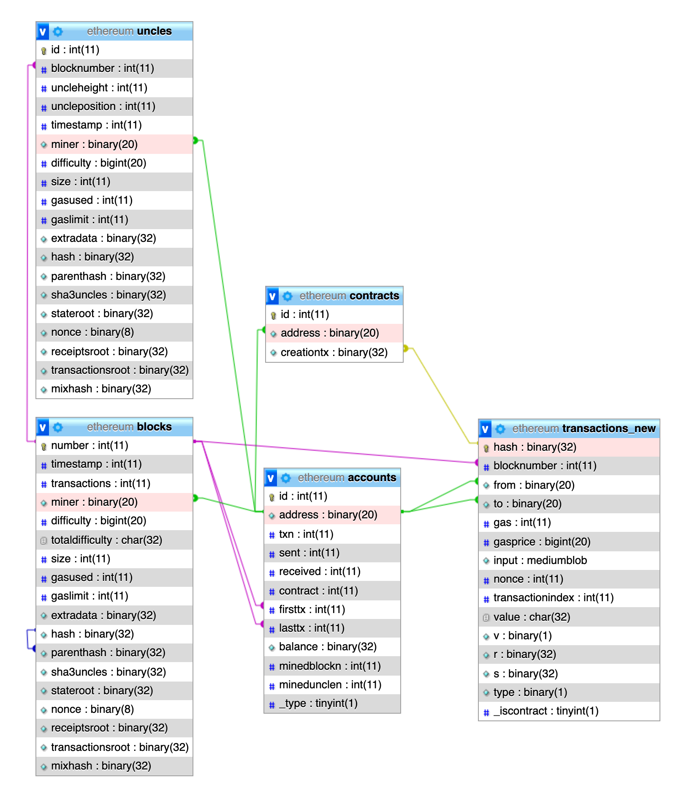

## Ethereum on-chain data analysis

* [block_tx_contract.js](block_tx_contract.js)
  * A node.js script to index block/uncle/transaction/contract DB into MariaDB from geth, as ```blocks```, ```uncles```, ```transactions```, ```contracts``` table.
  * Includes stationkeeper functionality, which keep track the latest block and index them.

* [account.js](account.js)
  * A nods.js script to iterate through all records in the ```transactions``` table, and records 1st/last appearance on the chain of all accounts as ```accounts``` table.

* [miner_block.js](miner_block.js), [miner_uncle.js](miner_uncle.js)
  * Node.js scripts to iterate through the ```blocks``` and ```uncles``` table to count mined blocks and uncles for every account.

* [restorelist.js](restorelist.js)
  * A node.js script to fetch the list of accounts to be restored per block.

### Script requirements
* Node.js

### DB structure and relationships

